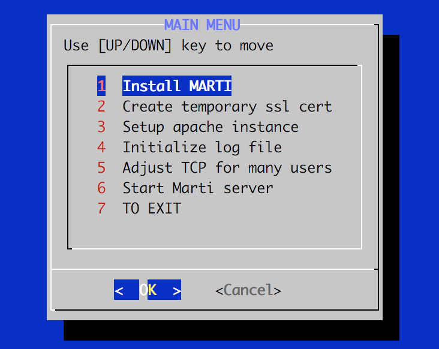

# Welcome to MARTI


## What Is MARTI?

The Mission Analysis and Research of Threat Information (MARTI) is a modification to [CRITs](#what-is-crits) that enables the creation of collaborative communities for cyber threat information sharing. MARTI incorporates STIX(TM) and TAXII(TM), standards developed by The MITRE Corporation under funding from the Department of Homeland Security (DHS). MARTI was developed by the Johns Hopkins University Applied Physics Laboratory (JHU/APL) under internal funding in 2016 to support a new type of organization called the Integrated Threat Analysis Capability (ITAC). 

The ITAC represents an analysis center, such as a State Fusion Center, Joint Operations Center (JOC), or Information Sharing Analysis Organization (ISAO). The ITAC can also be an analytical capability that can be added to existing environments to coordinate responses to distributed cyber threats. MARTI is based on the Dec 2015 version of [CRITs](https://github.com/crits/crits/commit/af358a3e2897f92c13bb2de0bd0c0dd4e9455882) and [CRITs Services](https://github.com/crits/crits_services/commit/f5b92a40240d76d2f3667abebd043c45d85ffae4) and adds the following features to CRITs:

- Auto-polling and auto-inboxing for STIX(TM) messages to be shared via the taxii_service
- Releasability sets an object to auto-inbox and sends to the selected feed whenever a field is modified
- Traffic Light Protocol (TLP) per the DHS standard
- Sightings based on the STIX(TM) format
- Cyber Kill Chain based on the Lockheed Martin publication
- Comments are sent via the STIX(TM) message unless marked private
- Sample and Email TLOs can be downloaded as an Intelligence Report (INTREP) that puts all fields into a Word or text document
- Some CRITs Top Level Objects (TLOs) are commented out of MARTI for ease of training new analysts, but can be un-commented for experienced users

## What Is CRITs?

CRITs is a web-based tool developed by MITRE, which combines an analytic engine with a cyber threat database that not only serves as a repository for attack data and malware, but also provides analysts with a powerful platform for conducting malware analyses, correlating malware, and for targeting data. These analyses and correlations can also be saved and exploited within CRITs. CRITs employs a simple but very useful hierarchy to structure cyber threat information. This structure gives analysts the power to 'pivot' on metadata to discover previously unknown related content.

Visit their [website](https://crits.github.io) for more information, documentation, and links to community content such as their mailing lists and IRC channel.

# Installation
---
MARTI can be installed manually or automated.

The [manual](#manual) install instructions below are a replica of the CRITs manual install instructions.

The [automated](#automated-install) instructions below were developed by the MARTI team to automate the manual CRITs installation [production](#production-install) process.

---

## Automated Install

The automated install script sets up the environment by installing the python libraries needed to properly run bootstrap and then also sets up the apache ssl options (many of which are done manually in the [production](#production-crits-install) section).

This script was developed and verified on a fresh install of ubuntu 16.04 server amd64.

Assuming you cloned the marti and marti-services into /opt/marti/marti and /opt/marti/marti-services respectively. You can run the [marti-install](script/marti-install.sh) script. 

```bash
/opt/marti/marti/script/marti-install.sh
```

If you cloned MARTI into a different location you can change the DIR variable before running the script.

```python
##############################################################################
#                            Global variables                                #
##############################################################################
...
DIR=/opt/marti/marti
```

NOTE: Make sure to write down the temporary password during the 'Install MARTI' step. If you forget, you will need to use manage.py to reset it (see crits documentation).



---

## Manual Install

CRITs is designed to work on a 64-bit architecture of Ubuntu or RHEL6 using Python 2.7. Installation has beta support for OSX using Homebrew. It is also possible to install CRITs on CentOS.

If you require the use of a 32-bit OS, you will need to download 32-bit versions of the pre-compiled dependencies.

The following instructions assume you are running Ubuntu or RHEL6 64-bit with Python 2.7. If you are on RHEL which does not come with Python 2.7, you will need to install it. If you do, ensure all python library dependencies are installed using Python 2.7. Also, make sure you install mod_wsgi against the Python 2.7 install if you are looking to use Apache. More information on this can be found in the Github wiki at https://github.com/crits/crits/wiki/Common-Questions.

### Quick install using bootstrap (non-ssl, useful for development)

CRITs comes with a bootstrap script which will help you:

* Install all of the dependencies.
* Configure CRITs for database connectivity and your first admin user.
* Get MongoDB running with default settings.
* Use Django's runserver to quickly get you up and running with the CRITs interface.

Just run the following:

```bash

    sh script/bootstrap
```

Once you've run bootstrap once, do not use it again to get the runserver going, you'll be going through the install process again. Instead use the server script:

```bash

    sh script/server
```

### Production install

If you are looking for a more permanent and performant CRITs installation or just interested in tweaking things, read more about setting up CRITs for [production](https://github.com/crits/crits/wiki/Production-grade-CRITs-install).

**Thanks for using MARTI!**
