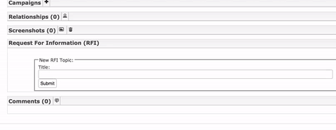

# Changes/Additions

Commented out unused items from the [details page](templates/comments_row_widget.html), as well as added new items and the ability to make comments private.

---

Added option for setting comment to private in [forms.py](forms.py) and [comment.py](comment.py)

```python
private = forms.BooleanField(required=False, label='private', help_text='Check to keep comment internal')
```



---

Added in a duplication check for incoming taxii messages. Comments are checked against the edit date as well as the comment text. 

---

Set releasability flag on new comment, if it's not private ([handlers.py](handlers.py))

```python
if not comment.private:
    set_releasability_flag(obj_type, obj_id, analyst)
```

# Bug fix
Added an option to export comment without converting to html ([handlers.py](handlers.py))

This is what allowed comments to be sent via TAXII.

```python
if html:
    result.comment_to_html()
final_comments.append(result)
```