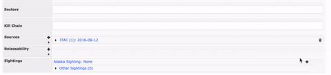
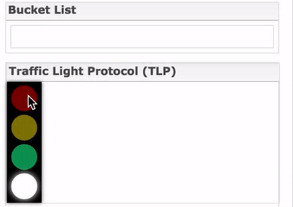
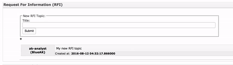
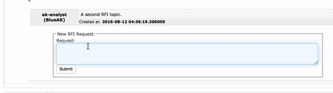
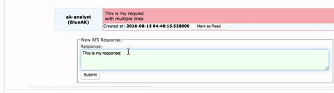
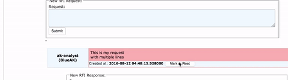
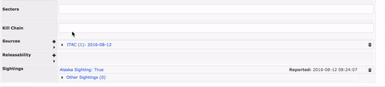
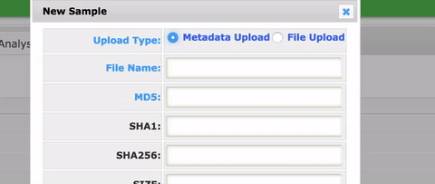
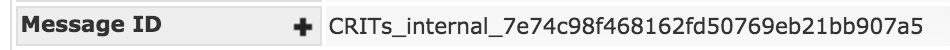
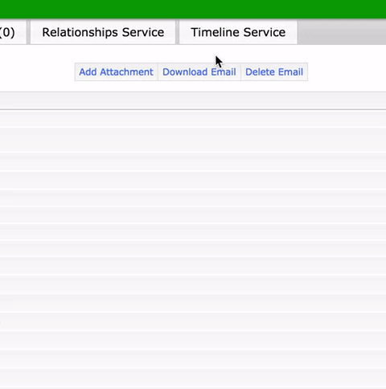

# New items

A couple new items were added to the core functionality. 

[crits_mongoengine.py](crits_mongoengine.py) -> [handlers.py](handlers.py) -> [views.py](views.py) -> html templates

The function names and descriptions are listed below but I encourage you to look over the entire function in order to better understand how everything works.

* [Sightings](#sightings)
* [TLP](#tlp)
* [RFI](#rfi)
* [Kill Chain](#kill-chain)

## Sightings
---
---

### Overview

A sighting is a way for a user to say they saw a TLO. This is important because now that TLO's are shared, one can obtain a TLO that they have yet to see on their network.

Sightings were based off of the way that CRITs implemented Releasability.

---

### Example



---

### Code Overview

At its core a sighting is simply a boolean for the user's organization as well as a list of other organization names and dates who saw the item.

[crits_mongoengine.py](crits_mongoengine.py)

```python
class Sightings(EmbeddedDocument, CritsDocumentFormatter):
    """
    Sightings class
    """

    class SightingInstance(EmbeddedDocument, CritsDocumentFormatter):
        """
        Sightings Instance Class
        """

        name = StringField()
        date = DateTimeField()

    sighting = BooleanField()
    date = DateTimeField()
    instances = ListField(EmbeddedDocumentField(SightingInstance))
```

```python
def set_sighting(self, date, value):
    """ Set the organizations sighting to this top-level object. """

def add_sighting(self, name, date):
    """ Add a sighting to this top-level object. """
```

[handlers.py](handlers.py)

```python
def set_sighting(type_, id_, date, value, user):
    """ Set sighting of a top-level object. """

def add_sighting(type_, id_, name, date, user):
    """ Add sighting to a top-level object. """
```

[views.py](views.py)

```python
def source_sighting(request):
    """ Modify a top-level object's sightings. Should be an AJAX POST. """
    ...
    #Set or reset sighting
    if action == 'set':
        result = set_sighting(type_, id_, datetime.datetime.now(tzutc()), True, user)
        set_releasability_flag(type_, id_, user)
    else:
        result = set_sighting(type_, id_, datetime.datetime.now(tzutc()), False, user)
    
```

[sightings_header_widget.html](templates/sightings_header_widget.html)
[sightings_list_widget.html](templates/sightings_list_widget.html)

---

### Database example

```bson
"sightings" : {
		"instances" : [
		    {
		        "name" : "Alaska",
		        "date" : ISODate("2016-08-11T16:31:43.158Z")
		    },
		    {
		        "name" : "Seattle,
		        "date" : ISODate("2016-08-11T16:31:43.158Z")
		    }
		 ],
		"date" : ISODate("2016-08-11T16:31:43.158Z"),
		"sighting" : true
	},
```

---

### Adding to TLO

To add to a TLO, add the following to the details page (the exmple below is for a domain, modify accordingly).

```html

     

```

## TLP
---
---

### Overview

A TLP is a DHS standard for setting the sensitivity of an indicator (TLO).

---

### Example



---

### Code Overview

TLP is implemented with a simple string. The string is controlled by the handlers function which checks the color against a set of valid colors. 

[handlers.py](handlers.py)

```python
def set_tlp(type_, id_, value, user):
    """ Set tlp of a top-level object. """
    ...
    if value not in ['AMBER', 'RED', 'GREEN', 'WHITE']:
        return {'success': False,
                'message': "Not a valid color"}
```

[views.py](views.py)

```python
def source_tlp(request):
    """ Modify a top-level object's tlp. Should be an AJAX POST. """ 
    ...
    result = set_tlp(type_, id_, color, user)
    set_releasability_flag(type_, id_, user)
```

[tlp_list_widget.html](templates/tlp_list_widget.html)

---

### Database example

```bson
"tlp": "AMBER"
```

---

### Adding to TLO

To add to a TLO, add the following to the details page (the exmple below is for a domain, modify accordingly).

```html

    

```

## RFI
---
---

### Overview

A RFI is used when an organization needs more information about a particular item. There is generally an RFI manager who will respond to requests.

RFI was based off of the way that CRITs implimented Sources.

---

### Example









---

### Code Overview

An RFI item is a three level deep nested list of lists. For each topic, there is a list of requests, and for each request there is a list of responses.

[crits_mongoengine.py](crits_mongoengine.py)

```python
class RFIItem(EmbeddedDocument, CritsDocumentFormatter):
    """
    RFIItem class
    """

    rfi = StringField()
    status = StringField(required=True, default='NEW')
    date = DateTimeField(default=datetime.datetime.now)
    analyst = StringField()
    source = StringField()
```

```python
class EmbeddedRFI(EmbeddedDocument, CritsDocumentFormatter):
    """
    EmbeddedRFI class
    """

    class RFIInstance(EmbeddedDocument, CritsDocumentFormatter):
        """
        RFIInstance class
        """
        
        request = EmbeddedDocumentField(RFIItem, default=RFIItem)
        response = ListField(EmbeddedDocumentField(RFIItem, default=RFIItem))


    topic = StringField()
    date = DateTimeField(default=datetime.datetime.now)
    analyst = StringField()
    source = StringField()
    instance = ListField(EmbeddedDocumentField(RFIInstance, default=RFIInstance))
```

```python
class MartiRFIDocument(BaseDocument):
    """ Inherit if you want to have rfi on a top-level object. """
    
    rfi = ListField(EmbeddedDocumentField(EmbeddedRFI), required=False)
    
    def toggle_rfi_status(self, topic, request, response=None):
        """ Toggles the RFI status of item (OLD/NEW) """
        
    def new_rfi_topic(self, topic, analyst, source, date=None):
        """ Adds a new RFI topic """
        
    def rfi_request(self, topic, rfi, analyst, source, date=None, status=None):
        """ Adds a new RFI request """
        
    def rfi_response(self, topic, rfi_response, rfi_request, analyst, source, date=None, status=None):
        """ Adds a new RFI response """
    
```

[handlers.py](handlers.py)

```python
def add_rfi(type_,id_, topic, analyst, source, date=None):
    """ Adds a new RFI """

def add_rfi_request(type_,id_, topic, rfi, analyst, source, date=None, status=None):
    """ Adds a new RFI response """

def toggle_rfi_status(type_,id_, analyst, topic, question, response=None):
    """ Toggles the RFI status of item (OLD/NEW) """

def add_rfi_response(type_,id_, topic, response, question, analyst, source, date=None, status=None):
    """ Adds a new RFI response """
```

[views.py](views.py)

```python
def add_rfi_item(request):
    """ Modify a top-level object's sightings. Should be an AJAX POST.  """
    ...
    if action == 'new':
            result = add_rfi(type_, id_, topic, user, get_user_organization(user))
        elif action == 'request':
            question = request.POST.get('request', None)
            result = add_rfi_request(type_, id_, topic, question, user, get_user_organization(user))
            set_releasability_flag(type_, id_, user)
        elif action == 'response':
            question = request.POST.get('request', None)
            response = request.POST.get('response', None)
            result = add_rfi_response(type_, id_, topic, response, question, user, get_user_organization(user))
            set_releasability_flag(type_, id_, user)
        elif action == 'toggle':
            r_type = request.POST.get('r_type', None)
            question = request.POST.get('request', None)
            response = request.POST.get('response', None)
            if r_type == 'Q':
                result = toggle_rfi_status(type_, id_, user, topic, question)
            elif r_type == 'A':
                result = toggle_rfi_status(type_, id_, user, topic, question, response)
            else:
                result = {'success':False, 'message': 'Toggle not valid'}
        else:
            result = {'success':False, 'message': 'Action not valid'}    
```

[rfi_list_widget.html](templates/rfi_list_widget.html)
[rfis_row_widget.html](templates/rfis_row_widget.html)

---

### Database example

```bson
"rfi" : [
		{
			"topic" : "This is a test",
			"date" : ISODate("2016-08-12T06:40:41.882Z"),
			"analyst" : "analyst",
			"source" : "BlueSC",
			"instance" : [
				{
					"request" : {
						"rfi" : "This is a request",
						"status" : "OLD",
						"date" : ISODate("2016-08-12T06:40:54.937Z"),
						"analyst" : "analyst",
						"source" : "BlueSC"
					},
					"response" : [
						{
							"rfi" : "This is a response",
							"status" : "NEW",
							"date" : ISODate("2016-08-12T06:41:04.746Z"),
							"analyst" : "analyst",
							"source" : "BlueSC"
						}
					]
				}
			]
		}
	],
```

---

### Adding to TLO

RFI is not included by default in a TLO, and therefore, it needs to be imported the same way as sources.

Add the following to the main TLO decloration (the exmple below is for a domain, modify accordingly).

```python
class Domain(CritsBaseAttributes, CritsSourceDocument, CritsActionsDocument,
             Document, MartiRFIDocument):
```

Add the following to the details page (the exmple below is for a domain, modify accordingly).

```html

    

```

## Kill Chain
---
---

### Overview

A kill chain identifies where in the attack process the TLO is/was.

Kill Chain was based off of the way CRITs implimeted Sectors.

---

### Example



---

### Code Overview


A kill chain is simply a list of strings that get mapped to the STIX LMCO standards.

[crits_mongoengine.py](crits_mongoengine.py)

```python
def set_kill_chain_list(self, kill_chain):
        """ Set kill_chain to this top-level object. """
```

[handlers.py](handlers.py)

```python
def modify_kill_chain_list(itype, oid, kill_chains, analyst):
    """ Modify the sector list for a top-level object. """
```

[views.py](views.py)

```python
def kill_chain_modify(request):
    """ Modify a sectors list for a top-level object. Should be an AJAX POST. """ 
```

[kill_chain_widget.html](templates/kill_chain_widget.html)

---

### Database example

```bson
"kill_chain" : [
		"5. Installation"
	]
```

---

### Adding to TLO

To add to a TLO, add the following to the details page (the exmple below is for a domain, modify accordingly).

```html

    

```

# Changes/Additions
            
Check to make sure MD5 is 32bit ([data_tools.py](data_tools.py))
   

   
```python
if re.match("^[a-fA-F0-9]{32}$", md5_checksum) == None:
    input_len = str(len(md5_checksum))
    retVal['message'] += "The MD5 digest needs to be 32 hex characters. Input was " + input_len + " characters long."
    retVal['success'] = False
```
            
---

Made email id the message_id ([class_mapper.py](class_mapper.py))



---

Added urls for killchain, rfi, tlo, and sightings ([urls.py](urls.py))

---

Updated dowload options to include intrep ([forms.py](forms.py))



```python
rst_fmt = forms.ChoiceField(choices=[("zip", "zip"),
                                     ("json", "JSON"),
                                     ("json_no_bin", "JSON (no binaries)"),
                                     ("intrep_docx","INTREP (word doc)"),
                                     ("intrep_txt","INTREP (txt doc)")],
                                     label="Result format")
```