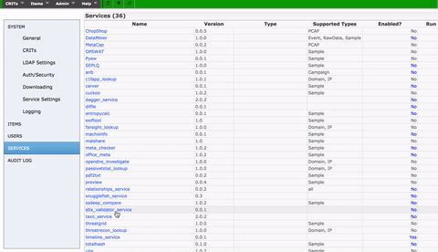

#Additions

Added walkthrough option to service config edit.

Used the intro.js library: https://github.com/usablica/intro.js

(See taxii_service readme for example)

```python
auto_inbox = forms.BooleanField(required=False,
                            label="Auto Inbox",
                            initial=False,
                            help_text="Auto send Taxii feeds.",
                            widget=forms.CheckboxInput(
                                attrs={'data-step': '8',
                                'data-intro': 'Do you want MARTI to send data to the TAXII server automatically (if released)?'})
```


#Bug Fixes
* Sevice config/edit now show up in place (vs before they showed up on a new page and you had to go back a page to get to the main GUI).


